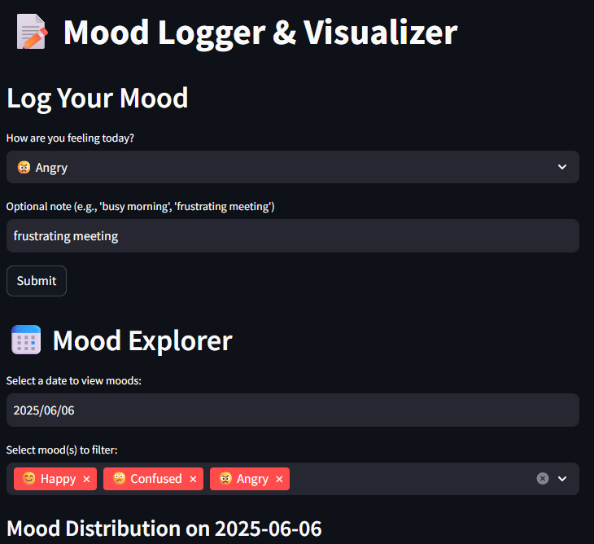
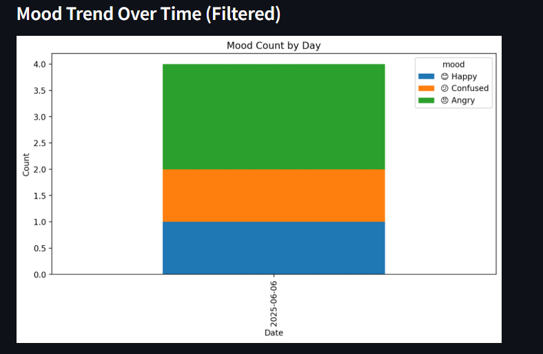

# Mochi_health

# 😊 Mood Logger & Visualizer

A lightweight internal tool built with **Streamlit**, allowing users to:
- Log daily moods with emoji selections and optional notes
- Store all entries in **Google Sheets**
- Visualize mood trends by day using **Matplotlib**
- Filter data by specific dates and moods

---

## 🚀 Features

✅ Log mood with optional note  
✅ Store logs with timestamp in a Google Sheet  
✅ View mood count for any selected date  
✅ Filter by one or more mood types (😊 😠 😕 🎉)  
✅ See mood trends over time with a stacked bar chart  
✅ Clean UI and one-click data refresh

---

## 🖼️ Screenshots

  


---

## 🧰 Tech Stack

- Python
- Streamlit
- Google Sheets API (via `gspread`)
- Matplotlib
- Pandas

---

## 📦 Requirements

Install dependencies:

```bash
pip install -r requirements.txt
